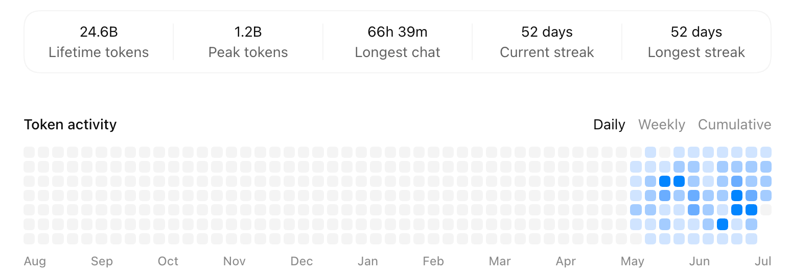

Two months ago, I mostly treated AI coding as a productivity tool: let the model read code, write code, fix bugs, and ideally run the build afterward. After two months of heavy use, I think the real change goes beyond typing code faster.

Here is the usage record first.

The number that stands out is probably the longest task. That does not mean Codex and I worked continuously for almost three days. The task had stopped at an authorization prompt, I did not notice, and I went off to enjoy my weekend. When I came back, it was still waiting for me to approve the next step.

So Codex contributed patience to that record. I contributed forgetting to check.

What matters more than the numbers is that I gradually turned Codex from a chat box that can write code into a way of working inside real repositories, carrying long tasks, validating results, and participating in delivery.

## From asking AI to write code to asking it to complete a piece of work

When I started using Codex, my requests were often one sentence long: implement a feature, fix an error, or improve a page.

That usually works for small tasks. Existing projects expose the weaknesses quickly. An agent can enter the wrong nested repository, treat an outdated API as the current contract, or declare success after a build without checking the real browser state. The longer the task becomes, the easier it is to end up with code that looks reasonable but a conclusion that is not reliable.

My requirements changed as a result.

At the start of a task, I now ask Codex to locate the real Git root, read the repository's `AGENTS.md`, and check the branch and uncommitted changes before locating the API, data structures, and existing components. After implementation, it has to validate the original path: backend changes through APIs and tests, frontend changes in a real browser, desktop changes against the real process and window, and delivery changes through the diff, staging area, and branch state.

This sounds slower than saying “finish the feature,” but it makes long tasks faster. The expensive part is not reading a few extra files. It is producing a large amount of plausible code from the wrong premise.

At that point, writing code becomes only one part of the task. I care more about whether Codex can understand context, break work down, use tools, validate results, record gaps, and stay inside an explicit authorization boundary.

## What I built during these two months

Codex participated in work across Rust, Java, React, Vue, and Tauri. It helped with API alignment, permission analysis, UI migration, browser verification, builds, and delivery. If I had to choose two projects that best represent what these two months produced, they would be `skills` and `rustzen-admin`.

### 1. Turning experience into 16 reusable Skills

I maintain a public [Agent Skills repository](https://github.com/idaibin/skills). It currently contains 16 independent Skills covering repository analysis, domain modeling, product specifications, frontend and backend development, Rust/Java/frontend audits, code review, Git delivery, browser and desktop verification, and technical writing.

At first, I also thought a Skill was simply a longer and more professional prompt. After using them for a while, the difference became much clearer.

A Skill that remains useful over time needs to define at least a few things: when it should trigger, where its evidence comes from, what it owns, what it must not do, what it should return, and how to verify that it stayed within scope.

For example, `repo-review` performs read-only review over a fixed scope and does not automatically edit code. `repo-delivery` handles commits, synchronization, and branch delivery, but does not reinterpret permission to edit as permission to push. `ops-browser` collects evidence from the real browser and does not treat a successful build as proof that a page is correct.

I also built a more unusual Skill called [`ask-chatgpt`](https://github.com/idaibin/skills/tree/main/skills/ask-chatgpt). It lets Codex ask a real ChatGPT session for an answer or an independent review from inside the current task. Codex prepares the question, evidence, and constraints, but only sends them after I explicitly authorize it. The response is not accepted blindly either; it is checked against the local code or document item by item. I used this path for an independent review before finalizing this article.

These Skills were not designed in one sitting. Most came from real failures: entering a parent directory instead of the actual repository, treating static analysis as runtime proof, ignoring a dirty worktree, expanding Git operations without authorization, or mixing evidence from a design screenshot with values computed in the browser.

Whenever the same problem appeared again, I wrote down the boundary, evidence, and validation method. Over time, Codex no longer had to rediscover how I wanted it to work on every task. It could reuse a stable set of engineering habits.

If you use Codex frequently, I would not start by collecting dozens of Skills. Find the instruction you repeat most often, or the task that causes the most rework, and turn that into one Skill that can actually be verified. That is more useful than installing a large collection of impressive-looking templates.

### 2. Continuously evolving a real Rust full-stack project

The other representative result is [rustzen-admin](https://github.com/idaibin/rustzen-admin), which I maintain. It is a Rust full-stack administration and operations project for small self-hosted environments. It includes an Axum backend, a React frontend, SQLite, deployment assets, multiple independent runtimes, and a recently added read-only operations command named `rz`.

I chose it because this kind of project cannot be completed by generating one code sample. It involves architecture boundaries, permissions, frontend-backend coordination, installation, release processes, and documentation consistency. If any layer is only “close enough,” integration eventually exposes the gap.

During the past two months, I used Codex to help converge module boundaries, organize shared contracts, harden permissions, migrate the frontend component system, verify the responsive login page, adjust the release structure, and implement the `rz` CLI. The important result is not that AI can write Rust. It is that an agent can work across several layers while preserving one product goal, provided the constraints are explicit.

Humans still cannot leave the decision loop. I have to decide which modules should be combined, which failure domains must remain independent, whether a CLI may perform write operations, and what evidence counts as completion. Codex can apply those decisions across dozens of files, but it cannot take responsibility for the product and engineering choices on my behalf.

## Five rules that survived the rework

### 1. Context quality matters more than prompt tricks

I rarely chase a single “perfect prompt” now. The important part is giving Codex the correct repository rules, API definitions, current implementation, error logs, and validation commands.

Controller and DTO definitions outrank fixtures for API parameters. Current components and design evidence define the UI structure. The current worktree defines Git state. Once the context is wrong, a more capable or more persistent model can simply produce more rework.

### 2. Rewrite “done” as verifiable evidence

“Fixed,” “should be fine,” and “the build passed” are incomplete conclusions.

I ask Codex to state what changed, what was validated, what that validation covers, and what remains unverified. A frontend build proves that the frontend builds; it does not prove that the real page is correct. A device-control API returning `true` does not prove that the physical device moved.

This makes results look less polished, but it makes them more trustworthy.

### 3. Authorization boundaries must be explicit

Editing code, committing, merging, pushing, and publishing are five separate actions.

The greatest risk in a long task is often not that the model cannot do the work, but that it interprets “continue” too broadly. I define the boundaries up front: preserve unrelated changes, avoid destructive cleanup, do not push just because the implementation is complete, and do not turn success in a test environment into a claim about production.

### 4. Skills should come from recurring problems

The value of a Skill is not that it makes the instruction look more sophisticated. Its value is preventing the same class of mistake from happening again.

If a task happens once, a clear task description is enough. If I have to explain the same boundary repeatedly, or the same mistake has appeared two or three times, it is worth turning the lesson into a Skill with failure cases and a validation method.

### 5. With heavy use, the bottleneck returns to the human

Codex can read many files, execute commands, and keep a task moving for a long time. Human attention does not scale at the same rate. As the number of tasks grows, I have to choose priorities, inspect conclusions, reject unnecessary refactors, and stop iterations that no longer have a useful return.

I spend less time typing code line by line and more time defining problems, deciding boundaries, and reviewing evidence. That does not remove the engineer from development. It moves the work from personally performing every step to making sure the whole path is correct.

## Next: let Codex run the full path from product to testing

The next question I want to test is whether Codex can connect product definition, UI design, implementation, and acceptance testing into one complete software delivery flow.

This does not mean letting AI decide everything. It means defining the inputs, outputs, and acceptance criteria for every stage: implementable requirements and rules in the product stage, design rationale and interaction states in the UI stage, repository-aligned implementation in development, and validation along the real runtime path in testing. Codex carries the context forward and advances the work; humans remain responsible for direction, tradeoffs, and final acceptance.

The outcome I want is not a demo that looks successful once. I want a reusable collaboration process that can work across projects and leave auditable evidence at every stage.

---

Related projects:

- [idaibin/skills: Agent Skills for real software engineering work](https://github.com/idaibin/skills)
- [idaibin/rustzen-admin: a Rust full-stack administration and operations project built with Axum and React](https://github.com/idaibin/rustzen-admin)
