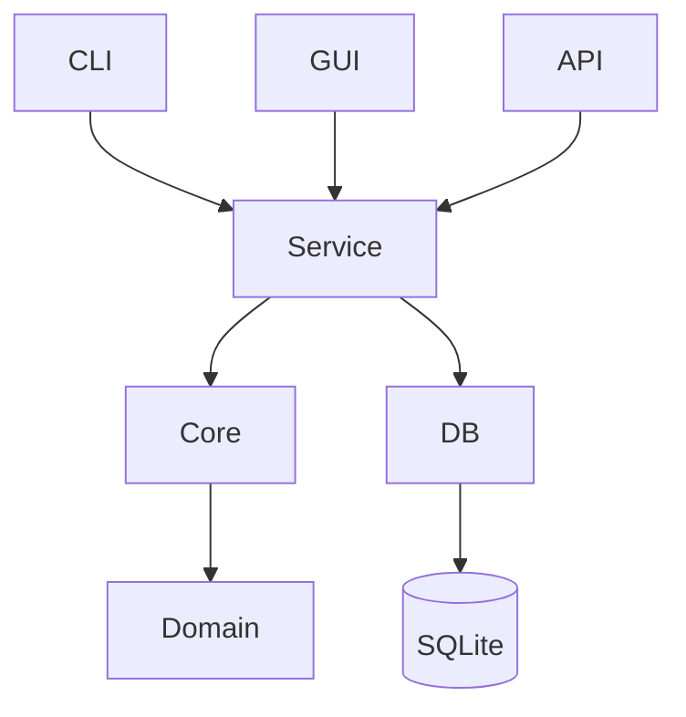

# Rustzen Multi-Repo Rust Audit

## Scope
All rustzen-* Rust repositories are being analyzed under a unified architecture review process.

## Methodology
- PASS 1: file-level Rust inspection
- PASS 2: cross-module consistency
- PASS 3: unified architecture synthesis

## Source Reconciliation

The earlier `rustzen-admin/audit/rustzen-series-v1` branch contained the first
working draft for this audit line. That draft covered `rustzen-admin`,
`rustzen-clear`, and `rustzen-clipboard` at PASS 1 and marked PASS 2/3 as
pending.

This blog audit article supersedes that branch. The branch material has been
absorbed into the Rustzen audit section and extended with additional repository
passes, final consistency articles, and the Rustzen Architecture v1 report.
Future updates to this audit line should happen in `rustzen/blog`, not in the
old `rustzen-admin` audit branch.

---

# 1. Current Cross-Repo Findings

## 1.1 Shared Patterns
- SQLite-first design across all Rust services
- Tokio async runtime used in server-side systems
- Clear separation between CLI / Core / GUI in newer repos

## 1.2 Recurring Structural Issues
- "God modules" in infra/service layers
- Mixed responsibilities in storage + migration + business logic
- Inconsistent naming between CLI commands and internal APIs
- Weak enforcement of module boundaries

---

# 2. Unified Rustzen Architecture Standard (v1)

## 2.1 Target Architecture Principles
- Local-first (SQLite default)
- Explicit runtime (no hidden frameworks)
- Strict module boundaries
- CLI-first controllability
- Observable by default (tracing mandatory)

---

# 3. Repo Organization Standard

## 3.1 Standard Layout
```
crate-root/
  apps/
    server/
    cli/
    gui/

  crates/
    core/
    db/
    service/
    domain/
    utils/

  infra/
    config/
    logging/
    runtime/
```

## 3.2 Rules
- apps/* = handlers ONLY (no business logic)
- service/* = orchestration only
- core/domain = pure logic
- db/* = persistence only

---

# 4. Architecture Governance Rules

## 4.1 God Module Definition
A module is GOD MODULE if:
- mixes >2 responsibilities (service + db + logic)
- exceeds ~800 LOC with multiple domains
- owns lifecycle + persistence + orchestration together

## 4.2 Required Direction
```
Handler -> Service -> Core -> DB
```

No reverse dependency allowed.

---

# 5. PR-Level Refactor Strategy

## 5.1 Refactor Phases
### Phase A: Extraction
- split service logic
- isolate db layer
- extract handlers

### Phase B: Stabilization
- enforce dependency direction
- remove cross-layer coupling

### Phase C: Standardization
- unify CLI mapping (rz system)
- align naming conventions

---

# 6. Per-Repo Refactor Guidance

## rustzen-clear
- split ZenService (scan/analyze/cleanup/restore)
- isolate scanner engine

## rustzen-clipboard
- split storage.rs (repository + history + settings)
- isolate clipboard capture loop

## rustzen-zipper
- split main.rs god module
- separate pack/unpack/filter engines

## rustzen-analytics
- split report service into aggregation + rendering

## rustzen-inspect
- separate scheduler vs execution engine

---

# 7. Dependency Rules

## Allowed
- service -> core
- service -> db
- handler -> service

## Forbidden
- handler -> db
- core -> db
- db -> service

---

# 8. Architecture Diagram



---

# 9. Evolution Rule
After each PASS cycle:
1. update architecture rules
2. refine CLI mapping
3. refine module boundaries
4. update diagram

---

# 10. Architecture Heatmap (UPDATED)

| Repo | Risk | Key Issue |
|------|------|----------|
| rustzen-clear | HIGH | ZenService god module |
| rustzen-clipboard | HIGH | storage + capture coupling |
| rustzen-zipper | HIGH | CLI monolith (main.rs) |
| rustzen-analytics | MEDIUM | report service overgrowth |
| rustzen-inspect | MEDIUM | scheduler + execution coupling |
| rustzen-admin | MEDIUM | infra/db over-responsibility |

---

# 11. Actionable Refactor Recommendations

## System-wide Actions
- enforce service/db split across all repos
- eliminate direct CLI → DB access
- unify error handling model
- standardize service naming conventions

## Priority Order
1. rustzen-zipper (highest risk CLI monolith)
2. rustzen-clear (ZenService split)
3. rustzen-clipboard (storage isolation)
4. rustzen-analytics (report decomposition)

---

# 12. Next Phase Targets
- introduce architecture lint rules (conceptual)
- define enforceable module boundaries
- generate future PR blueprints per repo

---

# 13. Final Goal
Rustzen evolves into:
> A strictly layered, CLI-driven, SQLite-first Rust ecosystem with enforceable architecture governance and deterministic modular decomposition across all repositories.

---

# 14. Incremental Audit: rustzen-zipper

## 14.1 Scope

Repository reviewed in this pass: `rustzen/rustzen-zipper`.

Reviewed files:

- `Cargo.toml`
- `README.md`
- `package.json`
- `index.js`
- `scripts/install.js`
- `scripts/verify-package.js`
- `scripts/test.js`
- `src/main.rs`

## 14.2 PASS 1 — File-Level Inspection

### `Cargo.toml`

Observed:

- Single Rust package: `rustzen-zipper`, version `0.2.0`, edition `2024`.
- Dependency set directly combines CLI parsing, filesystem walking, glob matching, zip writing, checksum generation, time formatting, and JSON config parsing.
- No internal crates or module-level boundaries are declared.

Architecture classification:

- Binary-only CLI crate.
- No explicit split between command entry, packaging logic, config parsing, and archive IO.

### `README.md`

Observed:

- Public command surface is documented as `rz-zip` and `rz-zip unpack`.
- Configuration source priority is documented as CLI args, explicit config path, workspace config files, then CLI defaults.
- Release/install contract depends on GitHub Release assets matching `Cargo.toml` and `package.json` version numbers.

Architecture classification:

- Documentation is operationally useful.
- CLI contract is more structured than the Rust source layout.
- The docs already imply separable domains: command entry, config resolution, pack, unpack, release packaging.

### `package.json`

Observed:

- npm package exposes only one binary command: `rz-zip`.
- `install` downloads the platform binary.
- `ci` combines Rust build/test/clippy with package verification.
- Package description says `CLI & JS library`, but the shipped JS entry behaves as a binary wrapper only.

Architecture classification:

- npm layer is a distribution wrapper, not an independent JS library layer.
- Version alignment is explicitly enforced by verification script.

### `index.js`

Observed:

- Resolves `bin/rustzen-zipper` or `bin/rustzen-zipper.exe`.
- Fails fast if the binary is missing.
- Delegates all arguments to the Rust binary with inherited stdio.

Architecture classification:

- Correct thin wrapper.
- No business logic leakage into JS entry.

### `scripts/install.js`

Observed:

- Detects target platform/architecture.
- Downloads `rustzen-zipper-<target-triple>` from GitHub Release `v${package.version}`.
- Writes into package-local `bin/` and applies executable permission on non-Windows platforms.

Architecture classification:

- Distribution responsibility is isolated in install script.
- Supported Linux target is only `x86_64-unknown-linux-gnu`; no arm64 Linux branch is present.

### `scripts/verify-package.js`

Observed:

- Verifies `Cargo.toml` and `package.json` version equality.
- Verifies npm dry-run package contents.
- Copies the debug Rust binary into package `bin/` and verifies wrapper execution via `node index.js --version`.

Architecture classification:

- Release contract is partially enforced.
- Verification protects package contents and wrapper wiring, but does not validate the GitHub Release asset matrix documented in README.

### `scripts/test.js`

Observed:

- Executes the debug binary directly from `target/debug`.
- Acts as a local postbuild smoke runner.

Architecture classification:

- Thin helper script.
- No architectural concern beyond release/test workflow coupling.

### `src/main.rs`

Observed line bands:

- Lines 3–14 import all runtime responsibilities in one file: CLI parsing, glob matching, JSON parsing, hashing, filesystem IO, timing, directory walking, zip reading, and zip writing.
- Lines 16–27 define root CLI and flatten pack options into the root command.
- Lines 29–34 define `unpack`, but mark it hidden while README documents it as a valid command.
- Lines 36–126 define the full pack CLI surface.
- Lines 128–141 define unpack options.
- Lines 143–159 define compression and overwrite enums.
- Lines 161–234 define runtime stats, runtime options, and config model in the same file as command execution.
- Lines 236–248 parse CLI and dispatch directly to `run_pack` / `run_unpack`.
- Lines 250–299 implement unzip validation, output directory preparation, archive traversal, path safety, file creation, and logging in one function.
- Lines 301–410 begin pack execution and already include config resolution, source validation, include/exclude parsing, output path construction, overwrite behavior, compression setup, archive prefix calculation, filesystem walking, matching, stats mutation, and archive entry collection.

Architecture classification:

- `src/main.rs` is a confirmed CLI monolith.
- Command declaration, option resolution, pack/unpack workflows, filesystem traversal, zip archive IO, output naming, filtering, logging, stats, and config model are co-located.
- The file matches the existing HIGH risk heatmap entry.

## 14.3 PASS 2 — Cross-File Consistency

### CLI surface

- README exposes `rz-zip unpack` as a current command.
- Rust command definition marks `unpack` as hidden.
- npm package exposes only `rz-zip`, which is consistent with the wrapper model.

Finding:

- CLI behavior exists, but help/discovery is intentionally or accidentally suppressed for a documented command.

### Distribution contract

- README says npm install downloads platform release assets.
- `install.js` implements that exact version/tag/asset model.
- `verify-package.js` validates package contents and local wrapper execution.

Finding:

- Distribution path is coherent.
- Release asset completeness remains documented but not locally verified.

### JS/Rust boundary

- `index.js` is only a binary launcher.
- `package.json` describes the package as `CLI & JS library`.

Finding:

- Runtime behavior is CLI-only.
- Metadata wording overstates the JS API surface.

### Rust source boundary

- `main.rs` owns CLI definition, config model, execution, pack logic, unpack logic, filesystem traversal, archive IO, checksum behavior, and reporting.

Finding:

- The repository has good user-facing feature coverage, but internal Rust boundaries are not aligned with the unified Rustzen rule: `apps/* = handlers only`, `service/* = orchestration only`, `core/domain = pure logic`.

## 14.4 PASS 3 — Unified Architecture Synthesis

### Confirmed repo status

`rustzen-zipper` remains HIGH risk because the Rust implementation is concentrated in one binary entry file.

### Standard refinement from this pass

For CLI-only Rustzen repositories:

- npm/JS wrappers are allowed to remain thin distribution adapters.
- Rust CLI entry must remain argument parsing and dispatch only.
- Pack/unpack workflows must be treated as separate command domains.
- Config resolution must not be mixed with archive IO.
- Filtering/path transformation must be deterministic logic and separable from filesystem writing.
- Release verification must cover version alignment, package contents, wrapper execution, and documented asset matrix.

### Consolidated rustzen-zipper audit result

| Area | Status | Notes |
|------|--------|-------|
| npm wrapper | PASS | Thin launcher only |
| install script | PASS | Platform download contract implemented |
| package verification | PARTIAL | Version/package/wrapper checked; asset matrix not checked |
| README | PARTIAL | Good operational docs; hidden `unpack` mismatch |
| Rust layering | FAIL | CLI, config, pack, unpack, IO, stats, filtering co-located |
| Heatmap status | HIGH | Existing classification confirmed |

## 14.5 Audit Delta

This pass does not change the global architecture direction.

It strengthens the existing rule that a small CLI tool can still violate Rustzen boundaries when `main.rs` owns command parsing, execution orchestration, filesystem traversal, archive IO, filtering, config parsing, and reporting together.

---

# 15. Incremental Audit: rustzen-clear

## 15.1 Scope

Repository reviewed in this pass: `rustzen/rustzen-clear`.

Reviewed files:

- `Cargo.toml`
- `README.md`
- `docs/10-architecture-design.md`
- `zen-core/Cargo.toml`
- `zen-cli/Cargo.toml`
- `zen-core/src/lib.rs`
- `zen-core/src/analyzer/mod.rs`
- `zen-core/src/analyzer/service.rs`
- `zen-cli/src/main.rs`
- `zen-cli/src/args.rs`
- `zen-cli/src/cmd_scan.rs`
- `zen-cli/src/cmd_reclaim.rs`
- `zen-cli/src/cmd_restore.rs`
- `zen-gui/src-tauri/src/state.rs`

## 15.2 PASS 1 — File-Level Inspection

### `Cargo.toml`

Observed:

- Workspace members are limited to `zen-cli` and `zen-core`.
- Shared dependency set includes CLI parsing, filesystem scanning, config parsing, traversal, hashing, tracing, and test support.
- `zen-gui` is intentionally outside the Cargo workspace while still documented as part of the repository.

Architecture classification:

- Workspace split is clearer than `rustzen-zipper` because CLI and core are separate packages.
- The split is still coarse: `zen-core` owns service, domain, scan, rules, license, config, safety, platform, and audit surfaces.

### `README.md`

Observed:

- Product positioning is developer-first macOS disk analysis and cleanup.
- Current status claims scan, analyze, clean, restore, CLI, desktop app, and cloud integration are available.
- Repository structure documents `zen-core`, `zen-cli`, `zen-gui`, docs, agent context, and common development commands.
- Safety principles are explicit: no silent deletion, no destructive defaults, no automatic high-risk selection, and review before cleanup.

Architecture classification:

- Public product contract is mature and safety-oriented.
- Documentation already defines separate product surfaces: core engine, CLI shell, desktop app, cloud-facing license/update clients.

### `docs/10-architecture-design.md`

Observed:

- Architecture document explicitly describes `zen-core` as domain + service and `zen-cli` / `zen-gui` as user-facing shells.
- CLI responsibilities are argument parsing, calling `ZenService`, and rendering text/JSON.
- GUI responsibilities are React rendering, Tauri handlers, and core consumption.
- Runtime boundaries say UI/Tauri dependencies must not enter `zen-core` and that license/update/payment/public-site services are external.

Architecture classification:

- The intended layer model is clear and mostly aligned with the unified Rustzen dependency direction.
- The documented `zen-core` boundary is broad: it combines domain logic, application service, filesystem work, license client, and configuration concerns.

### `zen-core/Cargo.toml`

Observed:

- `zen-core` depends on `reqwest` blocking client, base64, sha2, filesystem/path libraries, serialization, traversal, glob matching, hashing, and tracing.
- The same crate therefore hosts local filesystem analysis and external license/update-facing HTTP capability.

Architecture classification:

- `zen-core` is not pure domain only.
- It currently acts as a combined application core, infra adapter holder, and service API for CLI/GUI.

### `zen-cli/Cargo.toml`

Observed:

- Binary name is `zenclear`.
- CLI depends on `zen-core`, `clap`, `ctrlc`, `serde`, and `serde_json`.

Architecture classification:

- CLI package is thin at the dependency level.
- CLI does not pull in filesystem traversal or scanning libraries directly.

### `zen-core/src/lib.rs`

Observed:

- Exposes modules for analyzer, audit, config, license, platform, rules, safety, scan, and types.
- Re-exports `ZenService` and all public types.

Architecture classification:

- Public API is convenience-oriented.
- Broad re-export of all types weakens the boundary between command contracts, domain models, and internal engine models.

### `zen-core/src/analyzer/mod.rs`

Observed:

- Analyzer namespace includes analyze, category summary, cleanup apply, cleanup candidate, cleanup plan, cleanup preview, detector, large file, progress, reclaim, report, restore, service, and tree.
- `ZenService` is re-exported from this namespace.

Architecture classification:

- Analyzer package contains several distinct domains: analysis, cleanup planning, cleanup execution, restore, reporting, tree building, and service orchestration.
- The namespace is a functional aggregation point rather than a narrow analysis-only module.

### `zen-core/src/analyzer/service.rs`

Observed line bands:

- Lines 3–23 import config loading/saving, license manager, rules registry, scan engine, path helpers, development-cache reporting, analyzer modules, cleanup models, reclaim models, restore models, and scan models.
- Lines 31–37 define `ZenService` as owner of home directory, config, rule registry, and license manager.
- Lines 40–69 construct the service and mutate persisted application config.
- Lines 71–101 expose default scan and root-specific scan with optional progress.
- Lines 103–154 combine development-cache scanning with reclaim report generation.
- Lines 156–183 expose development-cache discovery separately from scan, but through the same service object.
- Lines 185–225 expose analyze, cleanup plan, cleanup preview, and cleanup apply in one service implementation.
- Lines 228–262 expose reclaim preview/apply using existing scan reports.
- Lines 263–285 add progress wrapping around reclaim apply.
- Lines 287–299 gate restore list/apply behind license status and call restore module operations.
- Lines 303–322 implement analysis orchestration and build tree/category/large-file/cleanup candidate outputs.
- Lines 326–584 define helper conversions between development-cache scan items and generic findings, safety-to-risk mapping, summary refresh, default scan context, privacy path exclusion, root resolution, and development-cache options.
- Lines 586 onward contain service-level tests including license storage helpers, device-id helpers, privacy exclusion tests, development cache root resolution, reclaim/preview coverage, and restore-related behavior.

Architecture classification:

- `ZenService` is a confirmed service facade with too many responsibilities.
- It coordinates config persistence, rule registry construction, scanning, development-cache discovery, analysis, cleanup planning, cleanup application, reclaim, restore, license gating, summary mutation, privacy defaulting, path resolution, and type conversion.
- This confirms the existing HIGH heatmap entry for `rustzen-clear`.

### `zen-cli/src/main.rs`

Observed:

- CLI entry declares command modules, parses args, installs an interrupt handler, constructs `ZenService`, and dispatches to command handlers.
- Command dispatch is limited to scan, analyze, reclaim, and restore.

Architecture classification:

- Main entry is thin and aligned with the Rustzen handler rule.
- It performs runtime setup and dispatch only.

### `zen-cli/src/args.rs`

Observed:

- CLI command surface is centralized: `scan`, `analyze`, `reclaim`, and `restore`.
- `reclaim` defaults to dry-run preview if neither `--preview` nor `--apply` is present.
- `restore --apply` requires at least one `--id`.
- Tests enforce important CLI argument constraints.

Architecture classification:

- CLI argument model is clear and test-backed.
- The naming differs from the README status wording: README says `restore`; code uses restore command; status also mentions `reclaim`, while safety copy uses cleanup terminology.

### `zen-cli/src/cmd_scan.rs`

Observed line bands:

- Lines 13–26 normalize roots, call `service.scan` / `scan_with_roots`, and build report output.
- Lines 29–35 split JSON and interactive behavior.
- Lines 37–50 call interactive reclaim preview/apply closures from the scan flow.
- Lines 52–120 implement terminal selection, preview display, confirmation prompt, and apply result output.
- Lines 131–184 implement selection parsing and validation.
- Test section validates selection parsing and preview/apply interactive flows.

Architecture classification:

- Command handler is not only a handler; it contains terminal workflow state and selection parsing logic.
- It does not directly access DB or filesystem scanning, but it does own interactive cleanup orchestration.

### `zen-cli/src/cmd_reclaim.rs`

Observed:

- Reclaim command defaults to preview.
- It calls `cleanup_preview` and `cleanup_apply` directly on `ZenService`.

Architecture classification:

- Handler remains thin.
- Terminology mismatch persists: command name is `reclaim`, service method uses `cleanup_*`, and result model uses cleanup result naming.

### `zen-cli/src/cmd_restore.rs`

Observed:

- Restore handler builds command request/response types, calls `service.restore_list` / `restore_apply`, and renders text or JSON.
- The conversion from trash entries to contract restore entries is local to the CLI command.

Architecture classification:

- Handler is reasonably narrow.
- Some response-shaping logic lives in CLI, but it does not leak storage implementation or direct filesystem mutation.

### `zen-gui/src-tauri/src/state.rs`

Observed:

- App state owns `Mutex<ZenService>`, a separate `Mutex<LicenseManager>`, scheduled scan history, cached development scan report, scan flags, and a JSON history path.
- It creates both `ZenService` and an independent `LicenseManager` using the same home directory.
- It persists scheduled scan history directly to `.zen-clear/scan-history.json`.
- It gates Pro features through the standalone `LicenseManager`, while restore gating also exists inside `ZenService`.

Architecture classification:

- GUI state is more than UI bridge state: it owns persistence for scan history and a parallel license-manager path.
- This creates a duplicated application-service boundary between `zen-gui` state and `zen-core::ZenService`.

## 15.3 PASS 2 — Cross-File Consistency

### Workspace and repository structure

- README documents `zen-core`, `zen-cli`, and `zen-gui` as repository packages.
- Cargo workspace includes only `zen-core` and `zen-cli`.
- Architecture docs explicitly treat `zen-gui` as outside the workspace but still part of the monorepo runtime model.

Finding:

- The workspace boundary is intentional, but the audit document should treat `zen-gui` as part of the product architecture even when it is not a Cargo workspace member.

### CLI/core boundary

- `zen-cli/src/main.rs` is a thin dispatcher.
- `zen-cli/src/args.rs` owns argument parsing and tests.
- `zen-cli/src/cmd_reclaim.rs` and `cmd_restore.rs` are thin command handlers.
- `zen-cli/src/cmd_scan.rs` adds interactive selection workflow and parsing.

Finding:

- CLI is mostly aligned with the handler-only rule.
- The scan command is the exception because interactive deletion selection and confirmation state are implemented inside the CLI layer.

### Core/service boundary

- Architecture docs say `zen-core` contains domain logic and application service.
- `ZenService` owns config loading/saving, rule registry initialization, license manager, scan context construction, scan/analyze/reclaim/restore orchestration, privacy defaulting, and development-cache conversion.

Finding:

- Current implementation follows the documented broad core boundary, but the broad boundary conflicts with the stricter unified Rustzen service/core split.

### License boundary

- README says cloud integration targets external Rustzen Cloud.
- Architecture docs state license/update/payment/public-site services are external to this repository.
- `zen-core` includes `license` and a blocking `reqwest` dependency.
- `zen-gui` also owns a separate `LicenseManager` in app state.

Finding:

- External service ownership is documented, but local client/gating responsibilities are distributed across core service and GUI state.

### Naming consistency

- Product docs use cleanup/reclaim language together.
- CLI command is `reclaim`.
- Core service exposes both `cleanup_*` and `reclaim_*` methods.
- README status lists `reclaim` and restore as CLI commands while safety copy describes cleanup targets and cleanup workflow.

Finding:

- The naming mismatch is not fatal, but it weakens the command-to-service contract clarity.

## 15.4 PASS 3 — Unified Architecture Synthesis

### Confirmed repo status

`rustzen-clear` remains HIGH risk, but with a different risk profile than `rustzen-zipper`.

- `rustzen-zipper` risk comes from a single-file CLI monolith.
- `rustzen-clear` risk comes from a broad service facade and duplicated application-state responsibilities across core and GUI.

### Standard refinement from this pass

For Rustzen GUI + CLI products:

- CLI and GUI shells may depend on the same application service, but they must not independently recreate application-service responsibilities.
- Core service APIs must make workflow boundaries explicit: scan, analyze, reclaim/cleanup, restore, license gating, config mutation, and history/state persistence are separate responsibility groups.
- UI state may cache presentation state, but durable product state must have one owner.
- Command naming must map consistently across docs, CLI args, service methods, and typed request/response models.
- External cloud/payment/update services may be represented by local clients, but gating policy should have one local boundary.

### Consolidated rustzen-clear audit result

| Area | Status | Notes |
|------|--------|-------|
| Workspace split | PASS | `zen-core` and `zen-cli` are separated |
| CLI entry | PASS | `main.rs` is thin dispatcher |
| CLI args | PASS | Command constraints are test-backed |
| CLI scan handler | PARTIAL | Interactive reclaim workflow lives in command handler |
| Core service | FAIL | `ZenService` owns too many product workflows and helper conversions |
| GUI state | PARTIAL | App state duplicates license boundary and owns durable scan history persistence |
| Documentation | PASS | Architecture intent and safety model are clear |
| Heatmap status | HIGH | Existing classification confirmed |

## 15.5 Audit Delta

This pass confirms that `rustzen-clear` is already more modular than `rustzen-zipper` at the package level, but the main architectural pressure has moved into `zen-core::ZenService` and `zen-gui` state.

The unified rule is refined as follows:

- A separated workspace is not sufficient if one application service owns most workflows.
- GUI state must not become a second application service.
- Safety-sensitive products need a single durable-state owner for cleanup history, restore metadata, license gating, and scan cache semantics.
- CLI command handlers may coordinate presentation flow, but safety-sensitive selection/confirmation semantics should remain traceable as typed workflow state rather than hidden terminal-only behavior.
