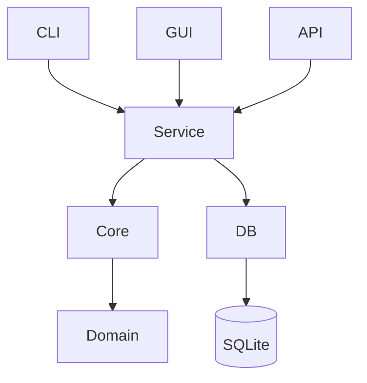

# Rustzen Multi-Repo Rust Audit

## Scope
All rustzen-* Rust repositories are being analyzed under a unified architecture review process.

## Methodology
- PASS 1: file-level Rust inspection
- PASS 2: cross-module consistency
- PASS 3: unified architecture synthesis

---

# 1. Current Cross-Repo Findings

## 1.1 Shared Patterns
- SQLite-first design across all Rust services
- Tokio async runtime used in server-side systems
- Clear separation between CLI / Core / GUI in newer repos

## 1.2 Recurring Structural Issues
- "God modules" in infra/service layers
- Mixed responsibilities in storage + migration + business logic
- Inconsistent naming between CLI commands and internal APIs
- Weak enforcement of module boundaries

---

# 2. Unified Rustzen Architecture Standard (v1)

## 2.1 Target Architecture Principles
- Local-first (SQLite default)
- Explicit runtime (no hidden frameworks)
- Strict module boundaries
- CLI-first controllability
- Observable by default (tracing mandatory)

---

# 3. Repo Organization Standard

## 3.1 Standard Layout
```
crate-root/
  apps/
    server/
    cli/
    gui/

  crates/
    core/
    db/
    service/
    domain/
    utils/

  infra/
    config/
    logging/
    runtime/
```

## 3.2 Rules
- apps/* = handlers ONLY (no business logic)
- service/* = orchestration only
- core/domain = pure logic
- db/* = persistence only

---

# 4. Architecture Governance Rules

## 4.1 God Module Definition
A module is GOD MODULE if:
- mixes >2 responsibilities (service + db + logic)
- exceeds ~800 LOC with multiple domains
- owns lifecycle + persistence + orchestration together

## 4.2 Required Direction
```
Handler -> Service -> Core -> DB
```

No reverse dependency allowed.

---

# 5. PR-Level Refactor Strategy

## 5.1 Refactor Phases
### Phase A: Extraction
- split service logic
- isolate db layer
- extract handlers

### Phase B: Stabilization
- enforce dependency direction
- remove cross-layer coupling

### Phase C: Standardization
- unify CLI mapping (rz system)
- align naming conventions

---

# 6. Per-Repo Refactor Guidance

## rustzen-clear
- split ZenService (scan/analyze/cleanup/restore)
- isolate scanner engine

## rustzen-clipboard
- split storage.rs (repository + history + settings)
- isolate clipboard capture loop

## rustzen-zipper
- split main.rs god module
- separate pack/unpack/filter engines

## rustzen-analytics
- split report service into aggregation + rendering

## rustzen-inspect
- separate scheduler vs execution engine

---

# 7. Dependency Rules

## Allowed
- service -> core
- service -> db
- handler -> service

## Forbidden
- handler -> db
- core -> db
- db -> service

---

# 8. Architecture Diagram



---

# 9. Evolution Rule
After each PASS cycle:
1. update architecture rules
2. refine CLI mapping
3. refine module boundaries
4. update diagram

---

# 10. Architecture Heatmap (UPDATED)

| Repo | Risk | Key Issue |
|------|------|----------|
| rustzen-clear | HIGH | ZenService god module |
| rustzen-clipboard | HIGH | storage + capture coupling |
| rustzen-zipper | HIGH | CLI monolith (main.rs) |
| rustzen-analytics | MEDIUM | report service overgrowth |
| rustzen-inspect | MEDIUM | scheduler + execution coupling |
| rustzen-admin | MEDIUM | infra/db over-responsibility |

---

# 11. Actionable Refactor Recommendations

## System-wide Actions
- enforce service/db split across all repos
- eliminate direct CLI → DB access
- unify error handling model
- standardize service naming conventions

## Priority Order
1. rustzen-zipper (highest risk CLI monolith)
2. rustzen-clear (ZenService split)
3. rustzen-clipboard (storage isolation)
4. rustzen-analytics (report decomposition)

---

# 12. Next Phase Targets
- introduce architecture lint rules (conceptual)
- define enforceable module boundaries
- generate future PR blueprints per repo

---

# 13. Final Goal
Rustzen evolves into:
> A strictly layered, CLI-driven, SQLite-first Rust ecosystem with enforceable architecture governance and deterministic modular decomposition across all repositories.

---

# 14. Incremental Audit: rustzen-zipper

## 14.1 Scope

Repository reviewed in this pass: `rustzen/rustzen-zipper`.

Reviewed files:

- `Cargo.toml`
- `README.md`
- `package.json`
- `index.js`
- `scripts/install.js`
- `scripts/verify-package.js`
- `scripts/test.js`
- `src/main.rs`

## 14.2 PASS 1 — File-Level Inspection

### `Cargo.toml`

Observed:

- Single Rust package: `rustzen-zipper`, version `0.2.0`, edition `2024`.
- Dependency set directly combines CLI parsing, filesystem walking, glob matching, zip writing, checksum generation, time formatting, and JSON config parsing.
- No internal crates or module-level boundaries are declared.

Architecture classification:

- Binary-only CLI crate.
- No explicit split between command entry, packaging logic, config parsing, and archive IO.

### `README.md`

Observed:

- Public command surface is documented as `rz-zip` and `rz-zip unpack`.
- Configuration source priority is documented as CLI args, explicit config path, workspace config files, then CLI defaults.
- Release/install contract depends on GitHub Release assets matching `Cargo.toml` and `package.json` version numbers.

Architecture classification:

- Documentation is operationally useful.
- CLI contract is more structured than the Rust source layout.
- The docs already imply separable domains: command entry, config resolution, pack, unpack, release packaging.

### `package.json`

Observed:

- npm package exposes only one binary command: `rz-zip`.
- `install` downloads the platform binary.
- `ci` combines Rust build/test/clippy with package verification.
- Package description says `CLI & JS library`, but the shipped JS entry behaves as a binary wrapper only.

Architecture classification:

- npm layer is a distribution wrapper, not an independent JS library layer.
- Version alignment is explicitly enforced by verification script.

### `index.js`

Observed:

- Resolves `bin/rustzen-zipper` or `bin/rustzen-zipper.exe`.
- Fails fast if the binary is missing.
- Delegates all arguments to the Rust binary with inherited stdio.

Architecture classification:

- Correct thin wrapper.
- No business logic leakage into JS entry.

### `scripts/install.js`

Observed:

- Detects target platform/architecture.
- Downloads `rustzen-zipper-<target-triple>` from GitHub Release `v${package.version}`.
- Writes into package-local `bin/` and applies executable permission on non-Windows platforms.

Architecture classification:

- Distribution responsibility is isolated in install script.
- Supported Linux target is only `x86_64-unknown-linux-gnu`; no arm64 Linux branch is present.

### `scripts/verify-package.js`

Observed:

- Verifies `Cargo.toml` and `package.json` version equality.
- Verifies npm dry-run package contents.
- Copies the debug Rust binary into package `bin/` and verifies wrapper execution via `node index.js --version`.

Architecture classification:

- Release contract is partially enforced.
- Verification protects package contents and wrapper wiring, but does not validate the GitHub Release asset matrix documented in README.

### `scripts/test.js`

Observed:

- Executes the debug binary directly from `target/debug`.
- Acts as a local postbuild smoke runner.

Architecture classification:

- Thin helper script.
- No architectural concern beyond release/test workflow coupling.

### `src/main.rs`

Observed line bands:

- Lines 3–14 import all runtime responsibilities in one file: CLI parsing, glob matching, JSON parsing, hashing, filesystem IO, timing, directory walking, zip reading, and zip writing.
- Lines 16–27 define root CLI and flatten pack options into the root command.
- Lines 29–34 define `unpack`, but mark it hidden while README documents it as a valid command.
- Lines 36–126 define the full pack CLI surface.
- Lines 128–141 define unpack options.
- Lines 143–159 define compression and overwrite enums.
- Lines 161–234 define runtime stats, runtime options, and config model in the same file as command execution.
- Lines 236–248 parse CLI and dispatch directly to `run_pack` / `run_unpack`.
- Lines 250–299 implement unzip validation, output directory preparation, archive traversal, path safety, file creation, and logging in one function.
- Lines 301–410 begin pack execution and already include config resolution, source validation, include/exclude parsing, output path construction, overwrite behavior, compression setup, archive prefix calculation, filesystem walking, matching, stats mutation, and archive entry collection.

Architecture classification:

- `src/main.rs` is a confirmed CLI monolith.
- Command declaration, option resolution, pack/unpack workflows, filesystem traversal, zip archive IO, output naming, filtering, logging, stats, and config model are co-located.
- The file matches the existing HIGH risk heatmap entry.

## 14.3 PASS 2 — Cross-File Consistency

### CLI surface

- README exposes `rz-zip unpack` as a current command.
- Rust command definition marks `unpack` as hidden.
- npm package exposes only `rz-zip`, which is consistent with the wrapper model.

Finding:

- CLI behavior exists, but help/discovery is intentionally or accidentally suppressed for a documented command.

### Distribution contract

- README says npm install downloads platform release assets.
- `install.js` implements that exact version/tag/asset model.
- `verify-package.js` validates package contents and local wrapper execution.

Finding:

- Distribution path is coherent.
- Release asset completeness remains documented but not locally verified.

### JS/Rust boundary

- `index.js` is only a binary launcher.
- `package.json` describes the package as `CLI & JS library`.

Finding:

- Runtime behavior is CLI-only.
- Metadata wording overstates the JS API surface.

### Rust source boundary

- `main.rs` owns CLI definition, config model, execution, pack logic, unpack logic, filesystem traversal, archive IO, checksum behavior, and reporting.

Finding:

- The repository has good user-facing feature coverage, but internal Rust boundaries are not aligned with the unified Rustzen rule: `apps/* = handlers only`, `service/* = orchestration only`, `core/domain = pure logic`.

## 14.4 PASS 3 — Unified Architecture Synthesis

### Confirmed repo status

`rustzen-zipper` remains HIGH risk because the Rust implementation is concentrated in one binary entry file.

### Standard refinement from this pass

For CLI-only Rustzen repositories:

- npm/JS wrappers are allowed to remain thin distribution adapters.
- Rust CLI entry must remain argument parsing and dispatch only.
- Pack/unpack workflows must be treated as separate command domains.
- Config resolution must not be mixed with archive IO.
- Filtering/path transformation must be deterministic logic and separable from filesystem writing.
- Release verification must cover version alignment, package contents, wrapper execution, and documented asset matrix.

### Consolidated rustzen-zipper audit result

| Area | Status | Notes |
|------|--------|-------|
| npm wrapper | PASS | Thin launcher only |
| install script | PASS | Platform download contract implemented |
| package verification | PARTIAL | Version/package/wrapper checked; asset matrix not checked |
| README | PARTIAL | Good operational docs; hidden `unpack` mismatch |
| Rust layering | FAIL | CLI, config, pack, unpack, IO, stats, filtering co-located |
| Heatmap status | HIGH | Existing classification confirmed |

## 14.5 Audit Delta

This pass does not change the global architecture direction.

It strengthens the existing rule that a small CLI tool can still violate Rustzen boundaries when `main.rs` owns command parsing, execution orchestration, filesystem traversal, archive IO, filtering, config parsing, and reporting together.
