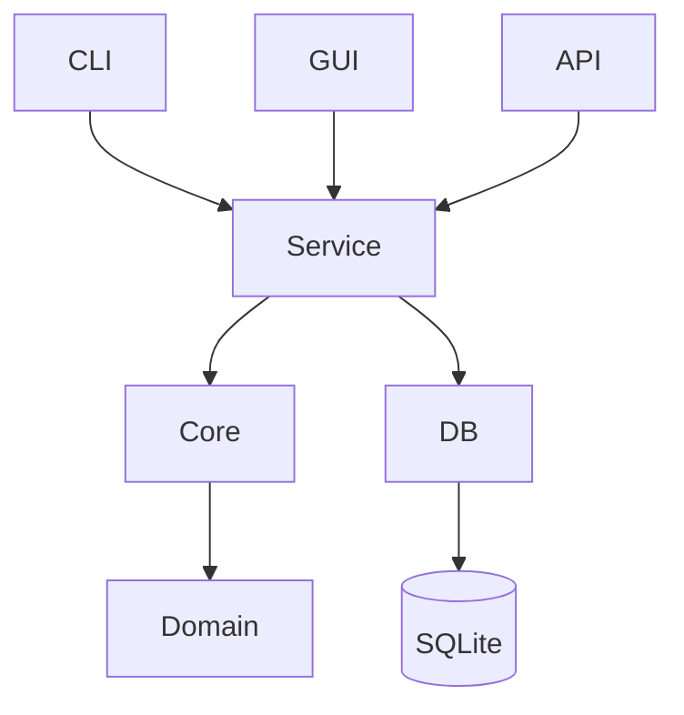

# Rustzen Multi-Repo Rust Audit

## Scope
All rustzen-* Rust repositories are being analyzed under a unified architecture review process.

## Methodology
- PASS 1: file-level Rust inspection
- PASS 2: cross-module consistency
- PASS 3: unified architecture synthesis

---

# 1. Current Cross-Repo Findings

## 1.1 Shared Patterns
- SQLite-first design across all Rust services
- Tokio async runtime used in server-side systems
- Clear separation between CLI / Core / GUI in newer repos

## 1.2 Recurring Structural Issues
- "God modules" in infra/service layers
- Mixed responsibilities in storage + migration + business logic
- Inconsistent naming between CLI commands and internal APIs
- Weak enforcement of module boundaries

---

# 2. Unified Rustzen Architecture Standard (v1)

## 2.1 Target Architecture Principles
- Local-first (SQLite default)
- Explicit runtime (no hidden frameworks)
- Strict module boundaries
- CLI-first controllability
- Observable by default (tracing mandatory)

---

# 3. Repo Organization Standard

## 3.1 Standard Layout
```
crate-root/
  apps/
    server/
    cli/
    gui/

  crates/
    core/
    db/
    service/
    domain/
    utils/

  infra/
    config/
    logging/
    runtime/
```

## 3.2 Rules
- apps/* = handlers ONLY (no business logic)
- service/* = orchestration only
- core/domain = pure logic
- db/* = persistence only

---

# 4. CLI Standard (rz System)

## 4.1 Command Model
```
rz <domain> <action> [args]
```

## 4.2 Examples
```
rz clear scan
rz clear analyze
rz clipboard list
rz analytics report
```

## 4.3 CLI Rules
- consistent verbs across repos
- no hidden subcommand ambiguity
- 1:1 mapping CLI → service

---

# 5. Architecture Diagram


---

# 6. God Module Rules

## Forbidden
- DB + business logic mixing
- CLI direct DB access
- global mutable caches
- migration in service layer

## Required
- dependency injection
- repository pattern
- strict service isolation

---

# 7. Repository Governance Model

Each repo MUST define:
- role (tool / system / platform)
- layer participation
- CLI mapping

---

# 8. Cross-Repo Evolution Rule
After every PASS cycle:
1. update architecture rules
2. refine CLI mapping
3. refine module boundaries
4. update diagram

---

# 9. Extension: Crate Boundary Rules

## Mandatory boundaries
- core cannot import infra
- service can import core + db
- db cannot import service
- cli/gui cannot import db directly

---

# 10. Extension: Handler Pattern

Handlers MUST:
- parse input
- call service only
- never contain logic

---

# 11. Final Target
Rustzen becomes:
> CLI-driven, SQLite-first, strictly layered Rust ecosystem with enforceable architecture rules and consistent repo structure across all modules.
