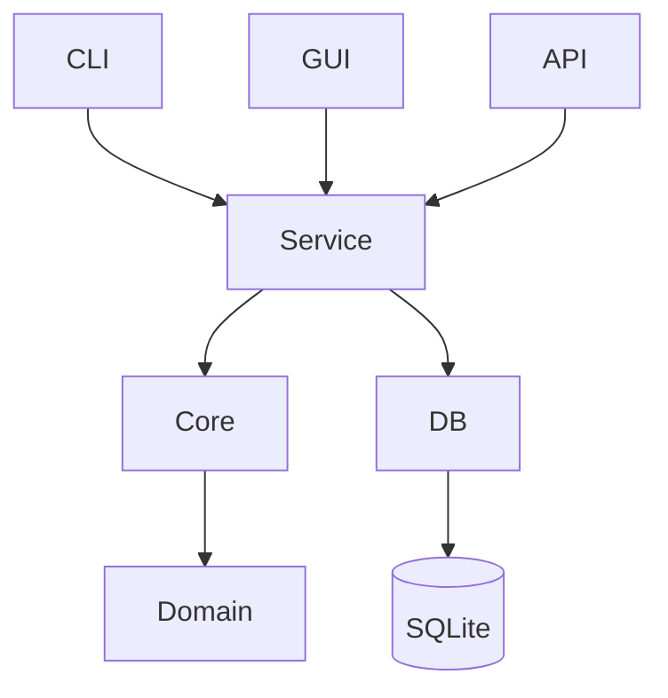

# Rustzen Multi-Repo Rust Audit

## Scope
All rustzen-* Rust repositories are being analyzed under a unified architecture review process.

## Methodology
- PASS 1: file-level Rust inspection
- PASS 2: cross-module consistency
- PASS 3: unified architecture synthesis

---

# 1. Current Cross-Repo Findings

## 1.1 Shared Patterns
- SQLite-first design across all Rust services
- Tokio async runtime used in server-side systems
- Clear separation between CLI / Core / GUI in newer repos

## 1.2 Recurring Structural Issues
- "God modules" in infra/service layers
- Mixed responsibilities in storage + migration + business logic
- Inconsistent naming between CLI commands and internal APIs
- Weak enforcement of module boundaries

---

# 2. Unified Rustzen Architecture Standard (v1)

## 2.1 Target Architecture Principles
- Local-first (SQLite default)
- Explicit runtime (no hidden frameworks)
- Strict module boundaries
- CLI-first controllability
- Observable by default (tracing mandatory)

---

# 3. Repo Organization Standard

## 3.1 Standard Layout
```
crate-root/
  apps/
    server/
    cli/
    gui/

  crates/
    core/
    db/
    service/
    domain/
    utils/

  infra/
    config/
    logging/
    runtime/
```

## 3.2 Rules
- apps/* = handlers ONLY (no business logic)
- service/* = orchestration only
- core/domain = pure logic
- db/* = persistence only

---

# 4. Architecture Governance Rules

## 4.1 God Module Definition
A module is GOD MODULE if:
- mixes >2 responsibilities (service + db + logic)
- exceeds ~800 LOC with multiple domains
- owns lifecycle + persistence + orchestration together

## 4.2 Required Direction
```
Handler -> Service -> Core -> DB
```

No reverse dependency allowed.

---

# 5. PR-Level Refactor Strategy

## 5.1 Refactor Phases
### Phase A: Extraction
- split service logic
- isolate db layer
- extract handlers

### Phase B: Stabilization
- enforce dependency direction
- remove cross-layer coupling

### Phase C: Standardization
- unify CLI mapping (rz system)
- align naming conventions

---

# 6. Per-Repo Refactor Guidance

## rustzen-clear
- split ZenService (scan/analyze/cleanup/restore)
- isolate scanner engine

## rustzen-clipboard
- split storage.rs (repository + history + settings)
- isolate clipboard capture loop

## rustzen-zipper
- split main.rs god module
- separate pack/unpack/filter engines

## rustzen-analytics
- split report service into aggregation + rendering

## rustzen-inspect
- separate scheduler vs execution engine

---

# 7. Dependency Rules

## Allowed
- service -> core
- service -> db
- handler -> service

## Forbidden
- handler -> db
- core -> db
- db -> service

---

# 8. Architecture Diagram



---

# 9. Evolution Rule
After each PASS cycle:
1. update architecture rules
2. refine CLI mapping
3. refine module boundaries
4. update diagram

---

# 10. Architecture Heatmap (UPDATED)

| Repo | Risk | Key Issue |
|------|------|----------|
| rustzen-clear | HIGH | ZenService god module |
| rustzen-clipboard | HIGH | storage + capture coupling |
| rustzen-zipper | HIGH | CLI monolith (main.rs) |
| rustzen-analytics | MEDIUM | report service overgrowth |
| rustzen-inspect | MEDIUM | scheduler + execution coupling |
| rustzen-admin | MEDIUM | infra/db over-responsibility |

---

# 11. Actionable Refactor Recommendations

## System-wide Actions
- enforce service/db split across all repos
- eliminate direct CLI → DB access
- unify error handling model
- standardize service naming conventions

## Priority Order
1. rustzen-zipper (highest risk CLI monolith)
2. rustzen-clear (ZenService split)
3. rustzen-clipboard (storage isolation)
4. rustzen-analytics (report decomposition)

---

# 12. Next Phase Targets
- introduce architecture lint rules (conceptual)
- define enforceable module boundaries
- generate future PR blueprints per repo

---

# 13. Final Goal
Rustzen evolves into:
> A strictly layered, CLI-driven, SQLite-first Rust ecosystem with enforceable architecture governance and deterministic modular decomposition across all repositories.
